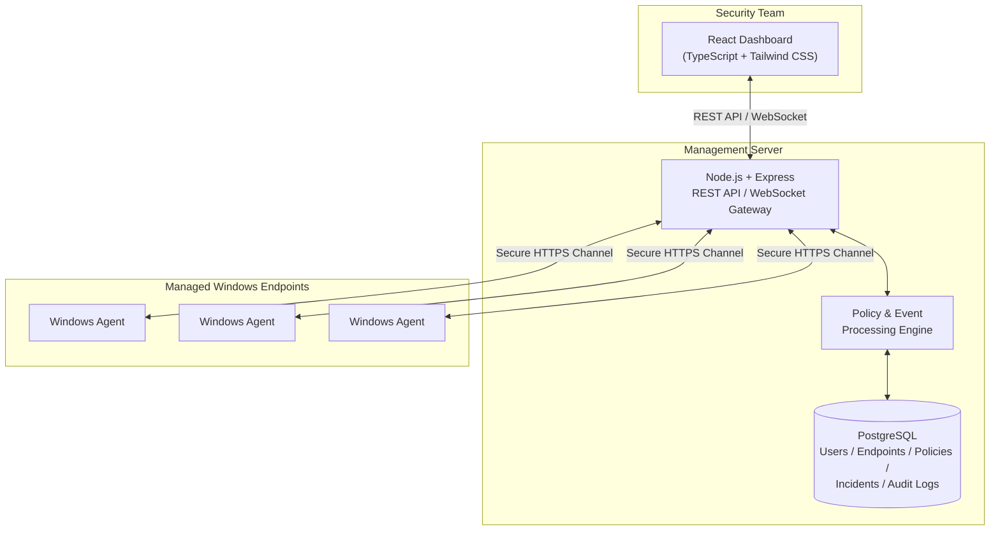

# Architecture

This document describes the system architecture of the DLP System platform: its major components, how they interact, and the data flow between the endpoint agent, management server, and administrative dashboard.

> **Note:** This describes the planned and locally-tested architecture. See [Project Status](../README.md#project-status) and [Deployment](deployment.md) for what is currently running versus what is planned.

---

## System Components

The platform is composed of four primary components:

1. **Windows Endpoint Agent** — installed on managed endpoints, responsible for monitoring and local policy enforcement.
2. **Management Server** — the central API and processing layer that agents and the dashboard communicate with.
3. **PostgreSQL Database** — persistent storage for endpoints, policies, events, incidents, and audit data.
4. **React Dashboard** — the web-based administrative interface used by security teams.

---

## Component Diagram

```text
                  +----------------------+
                  |   React Dashboard    |
                  +----------+-----------+
                             |
                    REST API / WebSocket
                             |
                  +----------+-----------+
                  | Node.js + Express    |
                  | Management Server    |
                  +----------+-----------+
                             |
                        PostgreSQL
                             |
                 Policy & Event Processing
                             |
                    Secure HTTPS Channel
                             |
     ------------------------------------------------------
       Windows Agent    Windows Agent    Windows Agent
```

### Mermaid Representation



---

## Component Responsibilities

### React Dashboard

- Presents endpoint inventory, policy management, incidents, alerts, and reports to security analysts and administrators.
- Communicates with the management server exclusively via authenticated REST API calls and a WebSocket channel for live status/alerts.
- Enforces role-based UI access aligned with server-side RBAC.

### Management Server (Node.js + Express)

- Exposes REST APIs consumed by the dashboard and endpoint agents.
- Authenticates and authorizes all incoming requests (dashboard sessions and agent connections).
- Hosts the **Policy & Event Processing** layer, responsible for:
  - Evaluating incoming agent events against active policies
  - Generating alerts and incidents when violations are detected
  - Computing risk classifications for events
- Persists all state to PostgreSQL.
- Terminates the secure HTTPS channel used for agent communication (via a reverse proxy in production, see [Deployment](deployment.md)).

### PostgreSQL Database

- Stores structured records for: users, endpoints, policies, events, incidents, audit logs, and reports.
- Acts as the system of record for compliance and investigation purposes.

### Windows Endpoint Agent

- Runs as a background service on managed Windows machines.
- Collects file, clipboard, device, and screenshot events per configured policy.
- Synchronizes policy definitions from the management server.
- Sends collected events to the management server over a secure channel, with local caching when offline.

Full agent design is documented in [endpoint-agent.md](endpoint-agent.md).

---

## Data Flow

1. **Policy Distribution** — the management server pushes/serves current policy definitions to each registered agent.
2. **Event Collection** — the agent observes file system, clipboard, device, and screenshot activity locally, applying local policy checks where applicable.
3. **Event Transmission** — the agent transmits structured event data to the management server over a secure channel, caching locally if the server is unreachable.
4. **Policy & Event Processing** — the server evaluates incoming events against active policies, computes risk classification, and raises alerts/incidents as needed.
5. **Persistence** — all events, policy evaluations, alerts, and incidents are persisted in PostgreSQL.
6. **Visualization & Investigation** — the dashboard queries the management server's REST API to display inventory, policies, incidents, and reports, with live updates delivered over WebSocket.

---

## Design Principles

- **Central policy authority** — policies are authored and managed centrally; agents enforce but do not author policy.
- **Resilience to disconnection** — agents cache events locally and sync once connectivity is restored, so short network interruptions do not result in data loss.
- **Least trust by default** — agents and dashboard sessions authenticate independently; no implicit trust between components.
- **Auditability** — every policy change, administrative action, and enforcement decision is designed to be traceable via audit logs.

---

## Related Documentation

- [Deployment](deployment.md)
- [Endpoint Agent](endpoint-agent.md)
- [Policy Engine](policy-engine.md)
- [Security](security.md)
