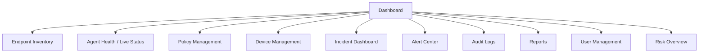

# Dashboard

This document describes the design of the centralized web dashboard used by security teams to manage policy, monitor endpoints, and investigate incidents.

---

## Purpose

The dashboard is the primary interface for security administrators and analysts. It is designed to provide a single, consolidated view of endpoint health, policy state, and security events across the managed fleet.

---

## Modules

### Endpoint Inventory

A complete listing of registered endpoints, including device identifiers, assigned users/departments, OS details, and enrollment status.

### Agent Health

Visibility into the operational status of each endpoint agent — last heartbeat, version, and connectivity state — derived from the heartbeat mechanism described in [Endpoint Agent](endpoint-agent.md).

### Live Status

A near real-time view of endpoint and agent status, updated via a WebSocket connection to the management server.

### Policy Management

The interface for authoring, assigning, and reviewing policies, as described in [Policy Engine](policy-engine.md).

### Device Management

Management of device control policy and visibility into connected/blocked peripheral devices across the fleet.

### Incident Dashboard

A working view of open, investigating, resolved, and closed incidents, per the workflow defined in [Incident Management](incident-management.md).

### Alert Center

A consolidated feed of policy-triggered alerts, allowing analysts to triage events before they are escalated into formal incidents.

### Audit Logs

A record of administrative actions (policy changes, user management, configuration changes) for accountability and compliance purposes.

### Reports

Access to the reporting suite described in [Reporting](reporting.md), including export to PDF, CSV, and Excel.

### User Management

Management of dashboard user accounts and role assignment, aligned with the RBAC model described in [Security](security.md).

### Risk Overview

A summary view surfacing risk indicators across the organization — highest-risk users, endpoints, and policy categories.

---

## Dashboard Information Architecture

---

## Access Model

Dashboard access is designed around role-based access control, so that analysts, administrators, and auditors see and can act on only what is relevant to their role. See [Security](security.md#role-based-access-control-rbac) for the full access model.

---

## Related Documentation

- [Architecture](architecture.md)
- [Policy Engine](policy-engine.md)
- [Incident Management](incident-management.md)
- [Reporting](reporting.md)
