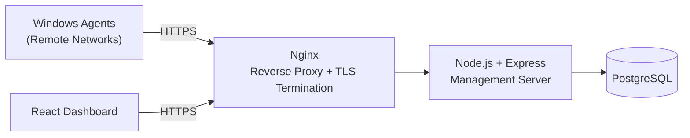

# Deployment

This document describes the current deployment state of the DLP System platform and the planned path to a production-ready public deployment.

---

## Current Deployment (Local Development)

| Item | Detail |
|---|---|
| Environment | Local development machine |
| Network Exposure | None (local network only) |
| TLS/HTTPS | Not yet configured |
| Purpose | Functional testing, architecture validation, iterative development |
| Endpoint Agents | Registered against the local management server for testing |

The management server, database, and dashboard currently run in a local development environment. This setup is used to validate the architecture end-to-end — agent registration, policy sync, event collection, and dashboard rendering — before any public exposure.

Because the environment is local, **HTTPS, reverse proxying, and public authentication hardening have not yet been applied**. These are explicitly scoped as the next milestone rather than assumed to already be in place.

---

## Planned Deployment (Public VPS)

The next milestone is deploying the management server to a **public VPS with a static public IP address**, enabling endpoint agents outside the local network to register and communicate securely.

### Planned Infrastructure

### Planned Components

| Component | Purpose |
|---|---|
| Ubuntu Server (VPS) | Host operating system for the management server and database |
| Static Public IP | Stable, externally reachable address for agent and dashboard connectivity |
| Nginx | Reverse proxy, TLS termination, and request routing |
| HTTPS (TLS Certificates) | Encrypts all traffic between agents, the dashboard, and the server |
| Firewall Rules | Restrict inbound access to required ports only |

### Planned Security Hardening for Public Deployment

- Enforce HTTPS-only communication (no plaintext fallback)
- Reverse proxy in front of the application server (no direct application exposure)
- Endpoint agent authentication required before accepting any event data
- Rate limiting and request validation at the proxy layer
- Restricted database access (no public database exposure)
- Regular OS and dependency patching process

---

## Deployment Roadmap

| Stage | Description | Status |
|---|---|---|
| 1 | Local development deployment | Complete |
| 2 | Functional validation of agent ↔ server ↔ dashboard flow | In Progress |
| 3 | Provision public VPS with static IP | Planned |
| 4 | Configure Nginx reverse proxy and HTTPS | Planned |
| 5 | Harden endpoint authentication for public exposure | Planned |
| 6 | Production-ready public deployment | Planned |

---

## Related Documentation

- [Architecture](architecture.md)
- [Security](security.md)
- [Roadmap](roadmap.md)
