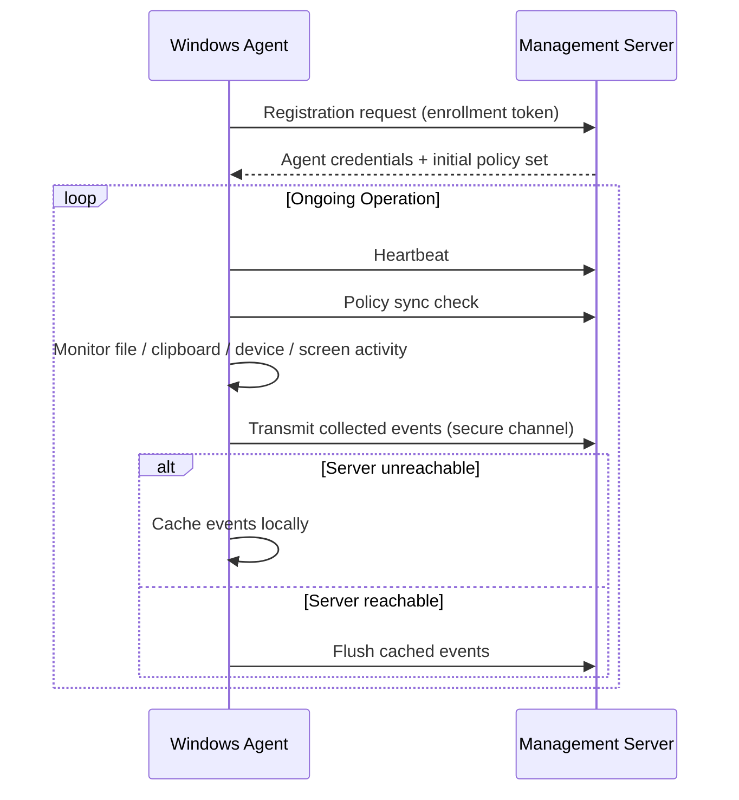

# Endpoint Agent

This document describes the design of the Windows endpoint agent — the component responsible for monitoring managed devices and enforcing policy locally.

---

## Purpose

The endpoint agent is a lightweight background service installed on managed Windows devices. It is designed to observe relevant system activity, apply locally-cached policy, and report structured events back to the management server, while remaining resilient to temporary network disruption.

---

## Responsibilities

### Endpoint Registration

- Registers the device with the management server on first run, providing a unique device identifier and initial inventory data.
- Registration is designed to require a valid enrollment credential/token issued by an administrator, preventing unauthorized agents from joining the fleet.

### Secure Authentication

- Authenticates to the management server using a per-agent credential established at registration.
- All communication uses the secure HTTPS channel described in [Security](security.md).

### Policy Synchronization

- Periodically retrieves the current policy set assigned to the device (directly, by user, or by department/group).
- Applies updated policies without requiring a full agent reinstall.

### Heartbeat Communication

- Sends periodic heartbeat signals to the management server, used to populate **Agent Health** and **Live Status** in the dashboard.
- Missed heartbeats beyond a configurable threshold are surfaced as an offline/unhealthy state.

### Device Inventory

- Collects hardware and software inventory data (device identifiers, OS version, connected peripherals) for asset visibility.

### Event Collection

The agent is responsible for collecting the following categories of events, each described in more detail in the main [README](../README.md#core-features):

- File activity (create, delete, modify, rename, move, copy, Save As)
- Sensitive data pattern matches within monitored file content
- Clipboard copy events
- Screenshot captures (policy-controlled)
- Device connection/usage events (USB, Bluetooth, Wi-Fi, Ethernet, external storage)

### Offline Event Caching

- When the management server is unreachable, events are cached locally on the endpoint.
- Cached events are synchronized once connectivity is restored, ensuring no event data is lost due to short network interruptions.

### Secure Communication

- All data transmitted to the management server is sent over an encrypted channel.
- Agent-to-server authentication ensures only registered, trusted agents can submit events or receive policy updates.

### Self-Update Support *(Planned)*

- Future support for the agent to receive and apply version updates distributed from the management server, reducing manual reinstallation across the endpoint fleet.

---

## Agent Lifecycle

---

## Design Considerations

- **Low footprint** — designed to run as an unobtrusive background service with minimal impact on endpoint performance.
- **Resilience** — designed to continue enforcing the last known policy and caching events during connectivity loss.
- **Tamper resistance** — designed with integrity checks to detect unauthorized modification or termination of the agent service (see [Security](security.md)).

---

## Related Documentation

- [Architecture](architecture.md)
- [Policy Engine](policy-engine.md)
- [Security](security.md)
