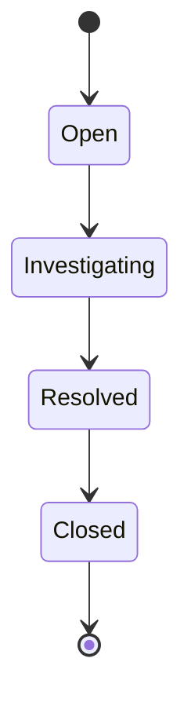
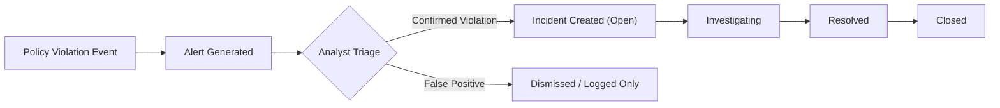

# Incident Management

This document describes the incident lifecycle and data model used by the platform to track and investigate policy violations.

---

## Purpose

Not every policy-triggered alert warrants a full investigation, but every confirmed violation needs a consistent, auditable record. The incident management workflow is designed to give security teams a structured process for triaging alerts into actionable, trackable incidents.

---

## Incident Lifecycle

| Stage | Description |
|---|---|
| **Open** | Incident created from a policy violation; not yet reviewed by an analyst |
| **Investigating** | An analyst is actively reviewing evidence and context |
| **Resolved** | Root cause identified and addressed; pending final confirmation |
| **Closed** | Incident fully reviewed and archived |

---

## Incident Record

Each incident is designed to contain the following fields:

| Field | Description |
|---|---|
| Severity | Assessed impact/risk level of the incident |
| User | The user account associated with the triggering activity |
| Endpoint | The device on which the activity occurred |
| Triggered Policy | The specific policy rule that was violated |
| Timestamp | When the triggering event occurred |
| Evidence | Supporting data — file metadata, screenshots, clipboard match context, device event details |
| Status | Current lifecycle stage (Open / Investigating / Resolved / Closed) |

---

## Incident Creation Flow

---

## Design Considerations

- **Evidence retention** — incidents are designed to retain sufficient evidence (file metadata, hashes, screenshots, matched content context) to support both internal review and compliance reporting.
- **Traceability** — every incident links back to the specific policy and event that triggered it, supporting root-cause analysis and policy tuning.
- **Auditability** — status transitions and analyst actions on an incident are designed to be logged for audit purposes, consistent with the platform's broader [audit logging](security.md#audit-logging) approach.

---

## Related Documentation

- [Policy Engine](policy-engine.md)
- [Dashboard](dashboard.md)
- [Reporting](reporting.md)
- [Security](security.md)
