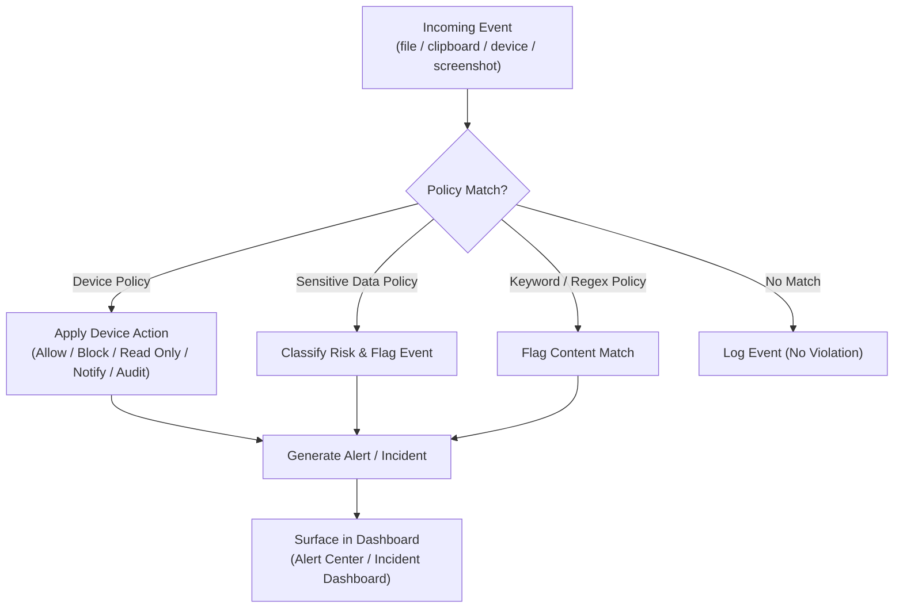

# Policy Engine

This document describes the design of the centralized policy engine — the component responsible for defining, distributing, and evaluating security policy across the endpoint fleet.

---

## Purpose

The policy engine provides a single, centralized authority for defining how sensitive data, devices, and user behavior should be governed across managed endpoints. Policies are authored centrally on the management server and enforced locally by endpoint agents.

---

## Policy Categories

### Device Restrictions

Policies that govern peripheral and removable device usage (USB storage, Bluetooth, Wi-Fi, Ethernet, external storage), using the actions described in [Device Control](../README.md#device-control): **Allow**, **Block**, **Read Only**, **Notify**, **Audit Only**.

### Sensitive File Protection

Policies that define which files or file locations are considered sensitive, and what actions (block, alert, audit) should occur when those files are moved, copied, or transferred.

### Keyword Detection

Policies that trigger when configured keywords (confidential terms, custom keywords) are detected within monitored content.

### Regular Expression Matching

Policies that use custom regular expressions to detect structured sensitive data (e.g., identifiers not covered by built-in detectors).

### Department-Based Policies

Policies scoped to specific departments or organizational units, allowing different risk tolerances across teams (e.g., stricter policy for Finance than for Marketing).

### User-Based Policies

Policies scoped to individual users or user groups, supporting exceptions and targeted enforcement.

### Time-Based Rules

Policies that apply conditionally based on time (e.g., stricter enforcement outside business hours).

### Risk-Based Enforcement

Policies that adapt enforcement based on a computed risk score for a user, endpoint, or event, allowing escalating responses for higher-risk contexts.

---

## Policy Evaluation Model

---

## Policy Scope & Precedence

Policies are designed to be assignable at multiple levels, with defined precedence to resolve overlapping rules:

1. **User-specific policy** (highest precedence)
2. **Department/group policy**
3. **Organization-wide default policy** (lowest precedence)

Time-based and risk-based conditions are designed to apply as modifiers on top of the resolved policy, rather than as a separate precedence tier.

---

## Policy Lifecycle

1. **Author** — an administrator defines a policy via the dashboard's Policy Management module.
2. **Assign** — the policy is scoped to a user, department, device type, or organization-wide.
3. **Distribute** — the management server makes the policy available for agent synchronization.
4. **Enforce** — the endpoint agent applies the policy locally and reports resulting events.
5. **Review** — administrators review triggered policies via the Incident Dashboard and Audit Logs, refining policy as needed.

---

## Related Documentation

- [Endpoint Agent](endpoint-agent.md)
- [Dashboard](dashboard.md)
- [Incident Management](incident-management.md)
