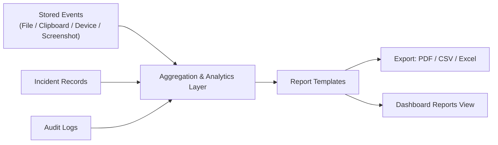

# Reporting

This document describes the design of the platform's reporting suite, used to summarize activity, violations, and compliance posture for stakeholders.

---

## Purpose

Reporting is designed to translate raw event and incident data into summaries suitable for security teams, IT leadership, and compliance stakeholders — from day-to-day operational reports to executive-level summaries.

---

## Planned Reports

| Report | Description |
|---|---|
| Endpoint Health | Agent connectivity, heartbeat status, and inventory summary across the fleet |
| Sensitive Data Events | Aggregated detections of sensitive data patterns (PAN, Aadhaar, card numbers, etc.) |
| USB Activity | Summary of removable storage device connections and policy actions taken |
| Clipboard Events | Summary of clipboard operations flagged by policy |
| File Activity | Aggregated file creation, modification, move, copy, and deletion activity |
| Policy Violations | Cross-category summary of all policy violations over a given period |
| User Activity | Per-user summary of monitored activity and violations |
| Incident Trends | Trend analysis of incident volume, severity, and resolution time |
| Executive Summary | High-level overview intended for leadership and non-technical stakeholders |
| Compliance Reports | Structured reports aligned to regulatory/compliance needs |

---

## Export Formats

Reports are designed to support export in the following formats:

- **PDF** — for formal distribution and archival
- **CSV** — for further analysis in spreadsheet or BI tooling
- **Excel** — for stakeholders who require native spreadsheet formatting

---

## Reporting Data Flow

---

## Design Considerations

- **Consistency with source data** — reports are designed to be generated directly from the same event and incident records surfaced elsewhere in the dashboard, avoiding divergent numbers between views.
- **Scheduling** *(Planned)* — future support for scheduled report generation and distribution (e.g., weekly executive summary).
- **Compliance alignment** — compliance-oriented reports are designed with future alignment to frameworks such as ISO 27001, PCI DSS, HIPAA, and GDPR (see [Roadmap](roadmap.md)).

---

## Related Documentation

- [Dashboard](dashboard.md)
- [Incident Management](incident-management.md)
- [Roadmap](roadmap.md)
