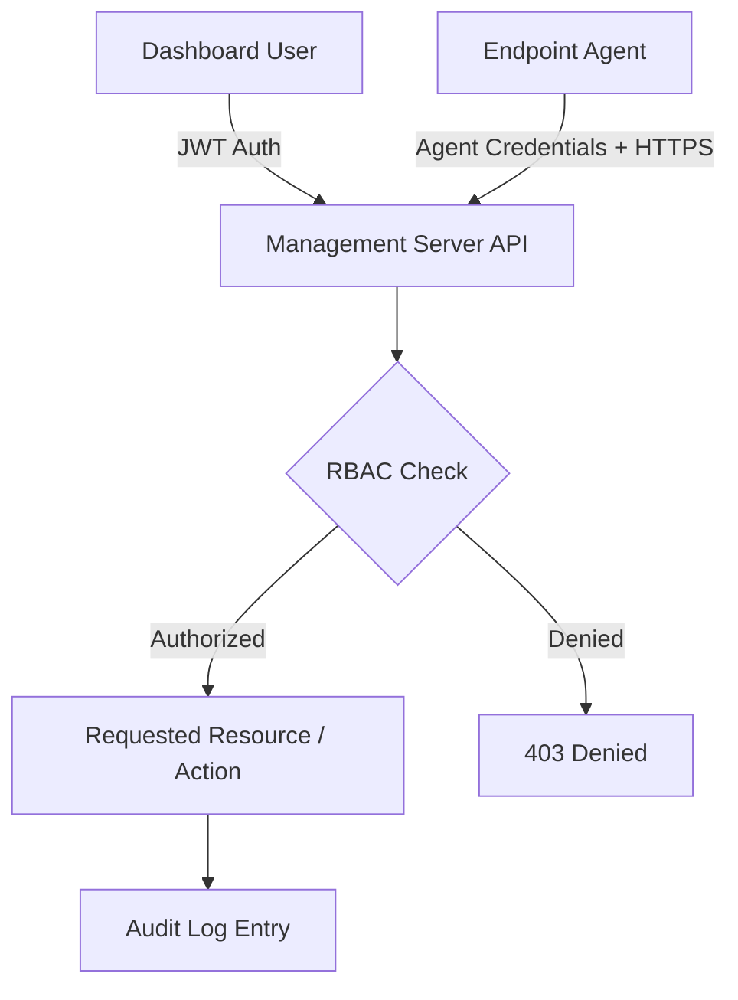

# Security Architecture

This document describes the security architecture and controls designed for the DLP System platform. As a security product, the platform's own security posture is treated as a first-class design concern.

> Items below reflect the **designed** security model for the platform. See [Project Status](../README.md#project-status) for what is currently implemented in the local development environment versus planned for the public deployment milestone.

---

## Core Security Principles

- **Secure by design** — security controls are designed into the architecture from the outset, not layered on afterward.
- **Principle of Least Privilege** — every component, role, and credential is scoped to the minimum access required.
- **Defense in depth** — no single control is relied upon exclusively; authentication, transport security, and audit logging are designed to be complementary layers.

---

## Transport Security

- **HTTPS communication** for all traffic between the dashboard, management server, and endpoint agents.
- TLS termination handled at the reverse proxy layer in the planned public deployment (see [Deployment](deployment.md)).

---

## Authentication & Access Control

### JWT Authentication

Dashboard and API sessions are designed to use JSON Web Tokens (JWT) for stateless session authentication between the frontend and the management server.

### Role-Based Access Control (RBAC)

Dashboard users are assigned roles (e.g., Administrator, Analyst, Auditor) that determine which modules and actions they can access — for example, restricting policy authoring to administrators while allowing analysts read/investigate access to incidents.

### Endpoint Authentication

Each endpoint agent authenticates to the management server using credentials established at registration, ensuring the server only accepts event data and policy sync requests from trusted, registered agents.

### API Authentication

All management-server API endpoints are designed to require authentication — no unauthenticated access to policy, event, or user data.

---

## Data & Credential Protection

### Secure Password Hashing

User credentials are designed to be stored using industry-standard adaptive password hashing (e.g., bcrypt/argon2-class algorithms), never in plaintext or reversible form.

### Audit Logging

Administrative actions — policy changes, user management, configuration changes, and incident status transitions — are designed to be recorded in an audit log for accountability and compliance purposes.

### Tamper Detection

The endpoint agent is designed with integrity checks intended to detect unauthorized modification, termination, or tampering with the agent process.

---

## Security Model Diagram

---

## Public Deployment Security Additions

The following controls are specifically scoped to the planned public VPS deployment (see [Deployment](deployment.md)):

- Reverse proxy (Nginx) in front of the application server — no direct application exposure
- TLS certificate management for HTTPS
- Firewall rules restricting inbound access to required ports
- Rate limiting on public-facing endpoints

---

## Related Documentation

- [Architecture](architecture.md)
- [Deployment](deployment.md)
- [Endpoint Agent](endpoint-agent.md)
